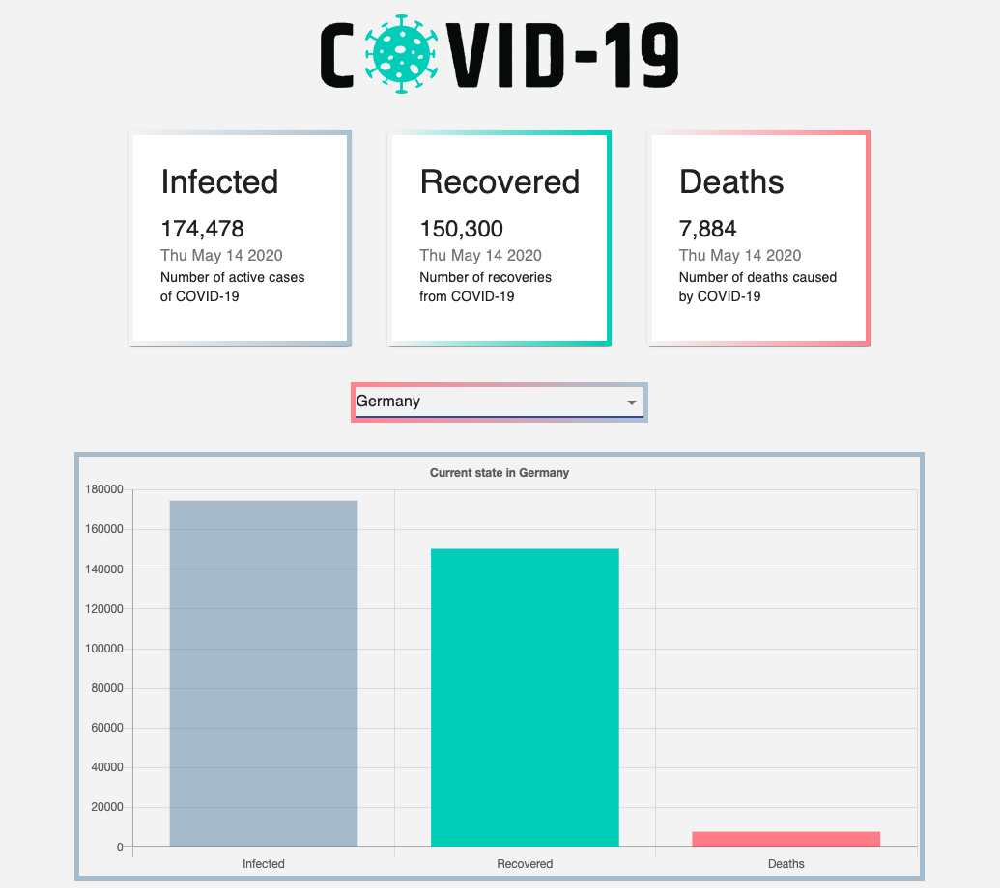

# COVID-19 Tracker

## Table of Content

* [User Story](#User)

* [Description](#Description)

* [Technologies Used](#Technologies-Used)

* [Credits](#Credits)

* [Installation](#Installation)

* [Deployed Link](#Deployed)

## User Story

```
As a user, I want to be able to see the most current COVID-19 statistics globally or filtered by country so that I can stay up to date and see if the numbers are going down.
```

## Description

This application was created by following this well done video from <a href="https://www.youtube.com/watch?v=khJlrj3Y6Ls"> JavaScript Mastery</a>. I recreated his application to further practice the use of React.js, the use of Hooks and to get an introduction to Material UI, while doing an interesting project.

## Technologies Used

The used technologies include react.js and the packages react-dom, chart.js, react-chartjs-2, react-countup, axios, and @material-ui/core. The third party API is https://covid19.mathdro.id/api

## Credits

Apart from some design changes and minimal set up changes the application was created by the github user <a href="https://github.com/adrianhajdin">adrianhajdin</a> and done by following his youTube Video, which is linked above. It was very helpful and I can recommend it for React beginners.

## Installation

Git pull or clone and run the following command to start:

```
    npm start
``` 

## Deployed Link:

The deployed link to Github Pages: <a href="https://steffield.github.io/react-covid19-app/">Covid-19 Tracker</a>.



## Questions

If you have any questions about the repo, open an issue.

 